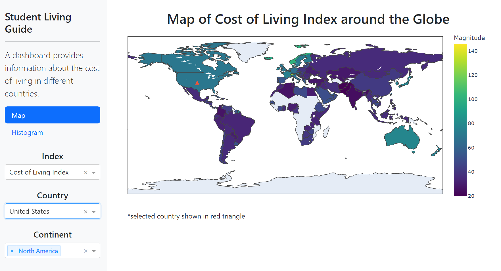
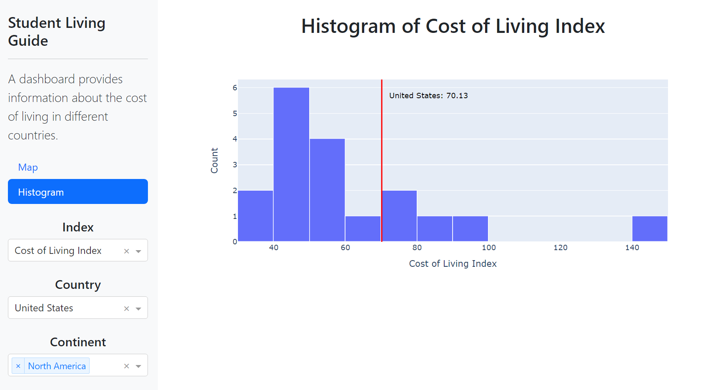

# Student Living Guide Dashboard

The Student Living Guide is an interactive dashboard that provides information about the cost of living in different countries for students live in New York. Users can interact with the app and customize the visualizations to explore specific indices, countries, or continents. You can find the details on the motivation behind the project in this [proposal](https://github.com/UBC-MDS/Student_Living_Guide/blob/main/reports/proposal.md).

Link to the live application on [render.com](https://yurui-student-living-dash.onrender.com/)

# Usage

To use the application, follow these steps:

Launch the application by clicking [here](https://yurui-student-living-dash.onrender.com/)



Interact with the sidebar on the left side of the dashboard to customize the visualizations:

- Index: Select an index from the dropdown menu to explore specific cost-of-living factors, such as rent, utilities, groceries, and more.
- Country: Choose a country from the dropdown menu to focus on its cost-of-living data. The selected country will be highlighted on the map and represented on the histogram.
- Continent: Select one or multiple continents from the dropdown menu to narrow down the data displayed on the histogram. This option allows you to compare countries within specific regions.

In addition, you can navigate between the two pages using the links in the sidebar:

Map: This page displays a world map with a color-coded representation of the selected index. The color intensity corresponds to the magnitude of the index value. The selected country is marked with a red triangle, and you can hover over the countries to see their names and index values.



Histogram: This page shows a histogram of the selected index for the countries in the chosen continent(s). The selected country's value is marked with a red line and annotation. The histogram allows you to visualize the distribution of the index values and compare the chosen country to others in the region.

With this interactive dashboard, users can easily explore the cost of living for students across different countries and compare various indices to make informed decisions about studying abroad.

# Developing the App Locally
To develop the Student Living Guide app locally, follow these steps:

### Prerequisites
Before you start, ensure that you have the following software installed on your system:

- Python 3.7 or higher
- Git
- Conda

### Clone the Repository
Clone the repository using the following command:
```
git clone https://github.com/Yurui-Feng/Student_Living_Guide_Dash.git
```
This will create a new folder named Student_Living_Guide_Dash with the project files inside.

### Navigate to the Student_Living_Guide_Dash 
```
cd Student_Living_Guide_Dash
```

### Create a new conda environment using the provided env.yaml file:
```
conda env create -f env.yaml
```
This command will create a new conda environment named slgdash with the required dependencies installed.

Activate the newly created conda environment:
```
conda activate slgdash
```

### Run the App
With the conda environment activated, run the script that contains the Dash app:
```
python app.py
```

Open a web browser and go to the address http://127.0.0.1:8050/ to view and interact with the app.
Now, you can make changes and contribute!


### Updating the Environment
If the env.yaml file is updated with new dependencies, you can update your local conda environment using the following command:

```
conda env update --file env.yaml --prune
```
This command will update the slgdash environment with the new dependencies and remove any packages that are no longer needed.

# Contributions
Interested in contributing? Please check out our [contributors' guidelines](CONTRIBUTING.md). 

It is important to maintain a welcoming and respectful environment while you contribute to the project. Before contributing, please take a moment to review the [code of conduct](CODE_OF_CONDUCT.md) to ensure that your contributions align with our values.

# Reference

The dataset is published by [Numbeo.com](https://www.numbeo.com/cost-of-living/rankings.jsp). You can find the term of use of the dataset [here](https://www.numbeo.com/common/terms_of_use.jsp).


# License

Licensed under the terms of the [MIT license](https://github.com/Yurui-Feng/Student_Living_Guide_Dash/blob/main/LICENSE.md).
